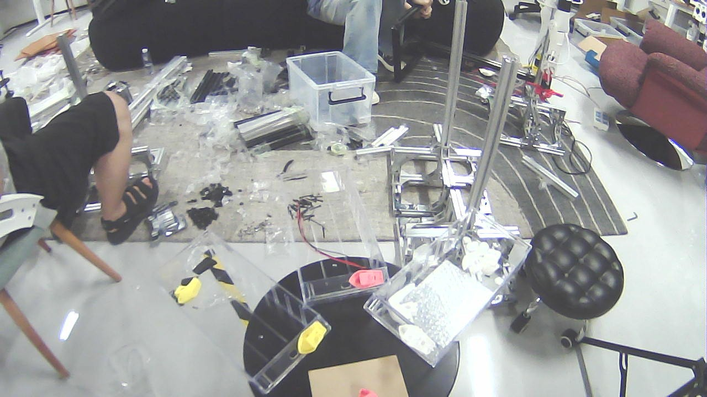
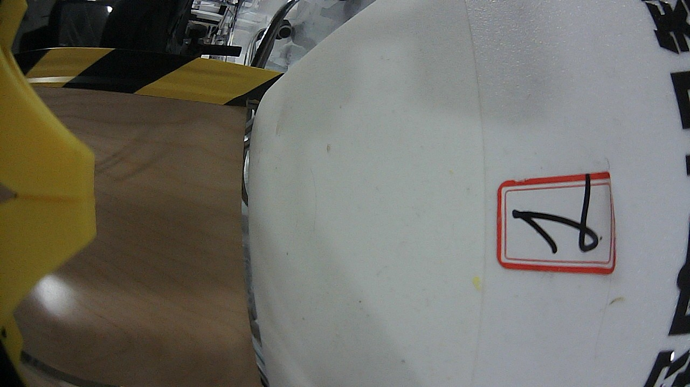
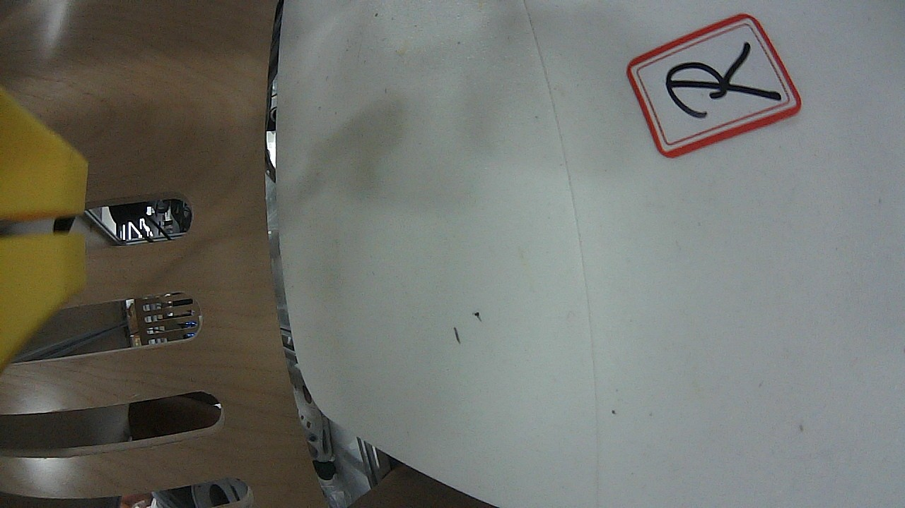

# dsh-ros2

> ROS2 调试工具集与机器人状态视觉分析能力，作为 [DeepSeek Harness](https://github.com/deepseek-ai/deepseek-harness) (DSH) 插件分发。

[](https://github.com/StvLi/dsh-ros2/actions/workflows/ci.yml)
[](https://github.com/StvLi/dsh-ros2/releases)
[](LICENSE)
[]()


**dsh-ros2** 让 DSH 智能体在一台装有 ROS2 的主机上获得完整的机器人开发/调试能力，分为四个能力层：

| 层级 | 能力 | 安全边界 |
| --- | --- | --- |
| **L1** | 只读诊断：包/工作区/依赖检查、节点/话题/服务/动作/参数/接口枚举、单帧话题采样、TF 树查询、全图拓扑 JSON、`ros2doctor`、bag 摘要 | 纯只读，无需审批 |
| **L2** | 审批门控管理：`colcon build`（后台任务）、`rosdep install`、自定义消息骨架生成、`param set`、限时 `bag record` | 写操作一律先审批（fail-closed） |
| **L3** | 可视化：RViz2 / rqt 生命周期管理、截图、多模态视觉描述、xdotool 级窗口交互 | 本地会话操作 |
| **L4** | 实时视觉：并行 VLM ROS2 节点 + 图像话题取帧（无头），外加 **RViz2 离屏渲染**（OGRE 渲染内核 → `/rviz/scene` 话题） | 纯软件渲染，无需显示器 |

所有工具直接调用宿主上的 `ros2` / `colcon` / `rosdep` CLI；L1 永远不修改任何东西，L2 永远先询问。

---

## 截图

| RViz2 离屏渲染（最新 `lite_urdf`，真实材质配色） | 头部相机 | 左手眼相机 | 右手眼相机 |
| --- | --- | --- | --- |
|  |  |  |  |

> 左图由 `rviz_offscreen_node` 在 Xvfb 下用真实 rviz 渲染栈（OGRE）渲染并发布到 `/rviz/scene` 图像话题；右侧三图由 `ros2_image_snapshot` 从相机话题取帧（1280×720）。完整实测记录见 [`docs/robot-state-vision-test.md`](docs/robot-state-vision-test.md)。

---

## 特性一览

- **零侵入诊断**：37 个工具覆盖 ROS2 调试的绝大多数场景，从"包装了没有"到"这一帧话题里是什么"，一条命令一个结果；
- **全图拓扑**：`ros2_graph` 将节点/发布/订阅/服务/动作折叠为一份 JSON，几秒看清系统结构；
- **审批门控的写操作**：构建、装依赖、生成消息骨架等写操作通过 DSH 审批服务，fail-closed，拒绝即失败；
- **可视化即服务**：无头也能"看"——截图/多模态描述/窗口交互全部本地化，不依赖远程显示；
- **并行实时视觉**：VLM 跑在独立 ROS2 进程（`vlm_node`，服务 `/vlm/describe`），图像来自话题（`sensor_msgs/Image` / `CompressedImage`），`vision_bringup` 自动为每个图像话题建桥，无头可用；
- **RViz2 离屏渲染（动作渲染 10Hz+）**：真实 rviz 渲染内核（`rviz_common` + OGRE）在虚拟显示器下渲染任意 `.rviz` 场景并发布为图像话题——不截图、不依赖 X11 窗口层级。**v0.9.0 性能优化**：open3d 低模 mesh（`scripts/simplify_visual_meshes.py`）+ OGRE 直接读像素（跳过 PNG 中转），动作渲染 1.9 → **10.2 Hz（5.4×）**，内存 -2.5×；
- **内置技能**：`ros2-diagnostics`（何时用哪个工具、如何由宽到窄排查）与 `robot-state-vision-analysis`（状态读取 → 离屏渲染 → VLM → 交叉验证的完整流水线）。

---

## 快速开始

### 环境要求

- 装有 ROS2 的主机（**Jazzy** 实测；Humble 应可用），`ros2` 在 `PATH` 上；
- Node `^22.19 || >=24`（DSH 宿主版本要求）；
- L4 视觉链路额外需要 Python 3 的 `rclpy` 与一个 OpenAI 兼容 VLM 网关（如 Gemini / 自建网关）。

### 安装插件

```bash
dsh plugin --profile <profile> add dsh-ros2
```

### 最小配置

```yaml
# DSH profile 的插件配置片段
- insert:
    - id: dsh-ros2
      name: dsh-ros2
      config:
        rosSetup: source /opt/ros/jazzy/setup.bash &&   # 准备 ROS2 环境
        workspaceRoot: /home/you/ros2_ws                 # colcon/rosdep 的默认工作目录
        vision:
          provider: gemini                               # mock | gemini | openai
          apiKey: ${GEMINI_API_KEY}                      # 经环境变量/密钥管理注入，勿写死
```

### 三分钟体验

```bash
ros2_graph                          # 一键看清系统拓扑
ros2_topic_list                     # 当前所有话题及类型
ros2_topic_echo /joint_states       # 采样一帧关节状态
ros2_tf_list                        # TF 树边
ros2_doctor                         # 系统健康报告
```

---

## 工具参考

### L1 只读诊断

| Tool | 底层命令 | 用途 |
| --- | --- | --- |
| `ros2_pkg_list` | `ros2 pkg list` | 已安装包（可选子串过滤） |
| `ros2_colcon_list` | `colcon list` | 工作区内的包 |
| `ros2_rosdep_check` | `rosdep check --from-paths src --ignore-src` | 依赖健康（缺依赖 = finding 而非 error） |
| `ros2_node_list` | `ros2 node list` | 运行中的节点 |
| `ros2_node_info` | `ros2 node info <node> [-v]` | 单节点订阅/发布/服务/动作 |
| `ros2_topic_list` | `ros2 topic list -t` | 话题及类型 |
| `ros2_topic_info` | `ros2 topic info <topic> [-v]` | 话题元数据 / QoS |
| `ros2_topic_echo` | `ros2 topic echo <topic> --once` | 单帧消息（尽量 JSON） |
| `ros2_service_list` | `ros2 service list -t` | 服务及类型 |
| `ros2_action_list` | `ros2 action list -t` | 动作及类型 |
| `ros2_param_list` | `ros2 param list <node>` | 节点参数 |
| `ros2_interface_show` | `ros2 interface show <type>` | 消息/服务/动作完整字段定义 |
| `ros2_graph` | `ros2 node list` + 逐节点 `node info` | 折叠式 JSON 拓扑图 |
| `ros2_tf_list` | `ros2 topic echo /tf --once` | 当前 TF 树边 |
| `ros2_tf_echo` | `ros2 topic echo /tf --once` | 两帧间变换 |
| `ros2_doctor` | `ros2 doctor` | 系统健康报告 |
| `ros2_bag_info` | `ros2 bag info <path>` | bag 摘要 |

### L2 管理（审批门控）

每个 L2 工具执行**写操作**，先经 DSH 审批服务询问用户（无审批服务/被拒 = fail-closed）。只读辅助 `ros2_jobs_list` / `ros2_job_status` 无需审批。

| Tool | 底层命令 | 说明 |
| --- | --- | --- |
| `ros2_colcon_build` | `colcon build [--packages-select ...] [--symlink-install]` | 以**后台任务**运行（`ctx.jobs`）；返回 `jobId`，用 `ros2_job_status` 跟踪 |
| `ros2_rosdep_install` | `rosdep install --from-paths src --ignore-src -y` | `dryRun` 用 `--simulate` 预览 |
| `ros2_interface_create` | 写入 `<root>/<pkg>/<msg\|srv\|action>/<Name>.*` | 骨架生成器；**绝不覆盖**已有文件 |
| `ros2_param_set` | `ros2 param set <node> <param> <value>` | JSON 数字/布尔按类型处理，其余按字符串 |
| `ros2_bag_record` | `ros2 bag record <topics...> --output <dir>` | 限时录制：`duration` 秒后自动停止 |
| `ros2_jobs_list` | `ctx.jobs.list` | 本智能体的后台任务（只读） |
| `ros2_job_status` | `ctx.jobs.get` | 按 id 查任务状态（只读） |

### L3 可视化

GUI 生命周期 + 截图 + 多模态视觉（"先能看，再谈动"）+ xdotool 级交互（"能看也能动"）。截图用 Pillow `ImageGrab`（X11，无需额外 CLI）；视觉 provider 可插拔；交互需 `xdotool`（`sudo apt install xdotool`）。

| Tool | 用途 |
| --- | --- |
| `ros2_gui_start` | 在宿主显示上启动 RViz2（支持 `-d config`）/ rqt_graph / rqt；会话被跟踪 |
| `ros2_gui_list` | 被跟踪会话 + X11 窗口（`wmctrl -lG`） |
| `ros2_gui_close` | 关闭会话（SIGTERM） |
| `ros2_screenshot` | 截屏或按窗口标题截图到 PNG |
| `ros2_vision_describe` | 用配置的多模态模型描述一张图片（Gemini / OpenAI / mock） |
| `ros2_gui_observe` | 确保 GUI 运行 → 截图 → 返回多模态描述（"看"工作流） |
| `ros2_gui_click` | xdotool 点击/滚动：激活窗口、移动指针、点击（`button` 4/5 = 滚动） |
| `ros2_gui_drag` | xdotool 拖拽：RViz2 视角控制（左键 orbit、中键 pan、右键 zoom） |
| `ros2_gui_key` | xdotool 键盘：组合键（如 `ctrl+shift+r` 重载 RViz2 显示配置）或输入文本 |

交互配方（模型视角）：`ros2_gui_drag {windowTitle: "rviz2", button: 1, toX: <dx>, toY: <dy>}` 环绕视角、`button: 3` 缩放、`ros2_gui_key {keys: "ctrl+shift+r"}` 重载配置。`wmctrl` 枚举不到窗口（如显示上没有窗口管理器）时窗口相对交互会报"未找到窗口"——退回绝对屏幕坐标。交互属于本地会话操作（无需审批，与其它 L3 工具一致）。

### L4 实时视觉（并行 VLM over ROS2，无头图像话题）

感知与机器人控制栈同构：VLM 跑在**独立 ROS2 进程**（`vlm_node`，服务 `/vlm/describe` + 缓存话题 `/vlm/description`），图像来自 **`sensor_msgs/Image` 话题而非 X11 截图**——无头就绪。需要 `dsh_ros2_vlm` ROS2 包（`vlm/`）；构建/运行见 [`docs/architecture.md`](docs/architecture.md) §4。

| Tool | 用途 |
| --- | --- |
| `ros2_image_snapshot` | 从图像话题抓最新帧（raw / compressed）存为 JPEG |
| `ros2_vlm_analyze` | 分析图像文件或桥的缓存帧（`useBridge`） |
| `ros2_vision_topics` | 列出实时图像话题及其自动桥服务名 |
| `ros2_vision_analyze` | 经自动桥分析任意话题最新帧（`ros2_vision_analyze {topic, prompt}`） |

```bash
# 构建并启动视觉流水线（每图像话题自动建桥）
mkdir -p /tmp/vlm_ws/src && ln -s <repo>/vlm /tmp/vlm_ws/src/dsh_ros2_vlm
cd /tmp/vlm_ws && colcon build --symlink-install && source install/setup.bash
VLM_API_KEY=... ros2 run dsh_ros2_vlm vlm_node &       # 并行 VLM 进程
ros2 run dsh_ros2_vlm vision_bringup &                 # 发现话题，每路一桥
```

### RViz2 离屏渲染（`dsh_ros2_rviz_offscreen`）

真实 rviz 渲染栈（`rviz_common` + OGRE + `rviz_default_plugins`）在 Xvfb（虚拟显示器）下加载 `.rviz` 场景离屏渲染，把画面发布为 `/rviz/scene` 图像话题——读取渲染内核而非 X 截图，无窗口层级依赖。

```bash
# 构建（需要 vlm_ws 同款工作区）
ln -s <repo>/offscreen /tmp/vlm_ws/src/dsh_ros2_rviz_offscreen
cd /tmp/vlm_ws && colcon build --symlink-install && source install/setup.bash
# 运行（config_path 指向 .rviz 场景文件）
xvfb-run -a -s "-screen 0 1280x800x24" ros2 run dsh_ros2_rviz_offscreen rviz_offscreen_node \
  --ros-args -p config_path:=/tmp/robot_scene.rviz -p topic:=/rviz/scene \
  -p width:=800 -p height:=600 -p rate:=5.0
```

**机器人本体 mesh 渲染要点**（踩坑总结，详见 [`docs/architecture.md`](docs/architecture.md) §4.4）：

1. **Jazzy RobotModel 属性**：用 `Description Source: Topic` + `Description Topic: <话题>`（旧版 `Robot Description:` 被忽略 → `Links` 为空）；
2. **mesh 路径**：URDF 内 mesh 用绝对路径或 `file://` 前缀（裸路径 `resource_retriever` fopen 失败）；发布者须常驻（transient-local，退出后新订阅者收不到）；
3. **URDF 与 TF 必须同名绑定**：URDF link 名必须与实时 TF 帧名完全一致（发布真机 `/robot_description` 即可）。**不匹配时所有 link 变换查找失败，mesh 全部堆到固定坐标系原点**；
4. **视距**：Orbit `Distance` ≈ 1.5–2.0 m 得到 RViz 式近景全身视角（>5 m 时缩成画面中心小点）；
5. **判定信号**：节点启动 ~3 s 后日志打印 `FM: ... frames=N` 与 `transformHasProblems(...)=0`，即 mesh 已正确绑定 TF。

---

## 内置技能

| Skill | 内容 |
| --- | --- |
| `ros2-diagnostics` | 何时用哪个工具、如何由宽到窄定位、排查"话题无数据"/消息格式不匹配/TF 问题的方法论 |
| `robot-state-vision-analysis` | 完整流水线：状态读取 → 离屏渲染 → 传 VLM → 交叉验证（含 Jazzy `Description Source/Topic`、URDF↔TF 帧名一致、`file://` mesh、视距 1.5–2.0 m 与 `FM frames` 判定信号） |

---

## 配置

| Key | 类型 | 默认 | 含义 |
| --- | --- | --- | --- |
| `rosSetup` | string | `''` | 准备环境的 shell 前缀，如 `source /opt/ros/jazzy/setup.bash && ` |
| `timeoutMs` | number | `15000` | 单命令超时 |
| `rosLogDir` | string | `''` | 覆盖 `ROS_LOG_DIR`（`~/.ros/log` 不可写时很有用） |
| `workspaceRoot` | string | `''` | 工具省略 `cwd` 时 `colcon`/`rosdep` 的工作目录 |
| `includeStderr` | boolean | `false` | 成功结果附带尾部 stderr |
| `display` | string | `''` | GUI/截图工具的 DISPLAY 覆盖 |
| `screenshotDir` | string | `''` | 截图输出目录（默认 `$TMPDIR/dsh-ros2`） |
| `screenshotCommand` | string | `''` | 自定义截图命令；`{output}` 替换为 PNG 路径 |
| `vision.provider` | string | `'mock'` | `mock` \| `gemini` \| `openai` |
| `vision.apiKey` | string | `''` | 你的 API key（用户提供；永不记录日志） |
| `vision.model` | string | `''` | 模型覆盖（如 `gemini-2.5-flash`、`gpt-4o-mini`） |
| `vision.baseUrl` | string | `''` | API base URL 覆盖（OpenAI 兼容端点） |

> `rosLogDir` 同样覆盖工具拉起的 ROS2 Python CLI（`topic echo/pub`、`ros2 run`）；此外 `runCommand` 在 `~/.ros/log` 不可写时自动回退到可写目录。

---

## 项目结构

```
dsh-ros2/
├── src/                  # DSH 插件本体（TypeScript）
│   ├── index.ts          # 插件入口：注册 37 个工具 + 2 个 skill
│   ├── tools.ts          # 工具定义（L1/L2/L3 参数与命令映射）
│   ├── vision.ts         # L4 视觉工具（snapshot / analyze / topics）
│   ├── gui.ts            # L3 GUI 生命周期与交互
│   ├── skill.ts          # ros2-diagnostics + robot-state-vision-analysis
│   ├── runner.ts         # 命令执行器（超时/日志/审批/后台任务 seam）
│   └── config.ts         # 配置读取与校验
├── vlm/                  # ROS2 包 dsh_ros2_vlm（Python）：vlm_node / vision_bringup / vlm_bridge_node / image_snapshot / vlm_call / vlm_bridge_call
├── offscreen/            # ROS2 包 dsh_ros2_rviz_offscreen（C++）：rviz_offscreen_node（OGRE 离屏渲染 → /rviz/scene）
├── docs/                 # 架构（architecture.md）、兼容基线（compatibility.md）、实测记录（robot-state-vision-test.md）、截图
├── tests/                # vitest（79 例，CLI 输出 mock）
├── .github/workflows/    # CI：Node 22/24 → typecheck/test/build/pack 校验
├── PUBLISH.md            # 开源发布清单（GitHub + npm + DSH 社区目录）
└── CHANGELOG.md          # 版本变更记录（Keep a Changelog）
```

---

## 故障排查 / FAQ

- **`~/.ros/log` Permission denied**：ROS2 写日志目录失败。设 `rosLogDir`（如 `/tmp/ros-log`）即可；`runCommand` 也会自动回退。
- **stderr 里一堆 `RTPS_TRANSPORT_SHM` / FastDDS SHM 警告**：SHM 传输不可用（常见于容器/受限环境）的无害噪音，工具默认丢弃。
- **`ros2 topic echo` 返回空**：先 `ros2_topic_info -v` 看 publisher 数与 QoS；transient-local 话题用 `--qos-durability transient_local` 采样。
- **RViz2 离屏渲染"零件全部堆在原点"**：URDF link 名与 TF 帧名不一致（详见上文 mesh 渲染要点 3）；先看节点日志 `FM transformHasProblems(<link>)=1` 定位。
- **RobotModel 没有 mesh（`Links` 空）**：Jazzy 必须用 `Description Source/Topic`，旧 `Robot Description:` 无效。
- **`Could not load resource ... Unable to open file`**：mesh 路径需绝对路径或 `file://` 前缀。
- **发布者退出后收不到描述**：URDF 发布者须常驻（transient-local 只对后订阅者补发一次，进程退出即失效）。
- **`vision_bringup` 只发现部分图像话题**：一次性发现可能不完整（实测 2/4 路），可用 `vlm_bridge_node` 手动补桥。

---

## 开发

```bash
pnpm install
pnpm run typecheck   # tsc --noEmit
pnpm run test        # vitest（79 例；CLI 输出 mock）
pnpm run build       # tsc -> lib/ + lib/types/
```

CI（`.github/workflows/ci.yml`）：push 到 `main` / PR 时在 Node 22 与 24 上跑 typecheck/test/build，并校验 `pnpm pack` 产物包含补丁层（`cordis.patch.yml`）与构建产物。

发布流程（npm 与 GitHub Release）见 [`PUBLISH.md`](PUBLISH.md)。

---

## 路线图

- [ ] `vision_bringup` 轮询/刷新发现（补全一次性发现漏掉的话题）；
- [ ] skill 补充各机器人零位语义（如"零位 = 侧平举、肘窝向前"）以提升 VLM 姿态解读精度；
- [ ] npm 发布（`pnpm publish --access public`，需 `npm login`）；
- [ ] 更多 ROS2 版本（Humble / Rolling）兼容验证。

---

## 文档

| 文档 | 内容 |
| --- | --- |
| [`docs/architecture.md`](docs/architecture.md) | 设计概览、四层能力、L4 视觉与离屏渲染架构、性能演进、安全模型 |
| [`docs/compatibility.md`](docs/compatibility.md) | 兼容基线 |
| [`docs/robot-state-vision-test.md`](docs/robot-state-vision-test.md) | 真机端到端实测：流水线、实时性、mesh/TF 绑定修复与验证、四路联合分析（含图） |
| [`CHANGELOG.md`](CHANGELOG.md) | 版本变更记录（Keep a Changelog） |

---

## 贡献

欢迎提交 Issue 与 PR（中文或英文均可）。请保证 `pnpm run typecheck && pnpm run test && pnpm run build` 全绿，并更新相应文档。

## 致谢

- [DeepSeek Harness](https://github.com/deepseek-ai/deepseek-harness) — 插件宿主框架；
- ROS2 / RViz2 社区 — 渲染与工具链基础。

## License

[MIT](LICENSE)
