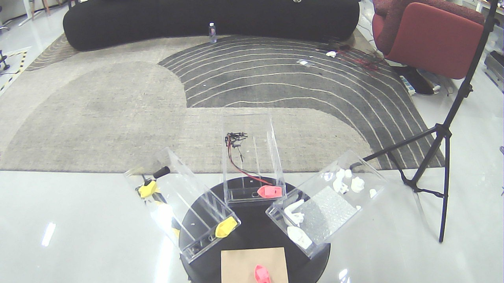
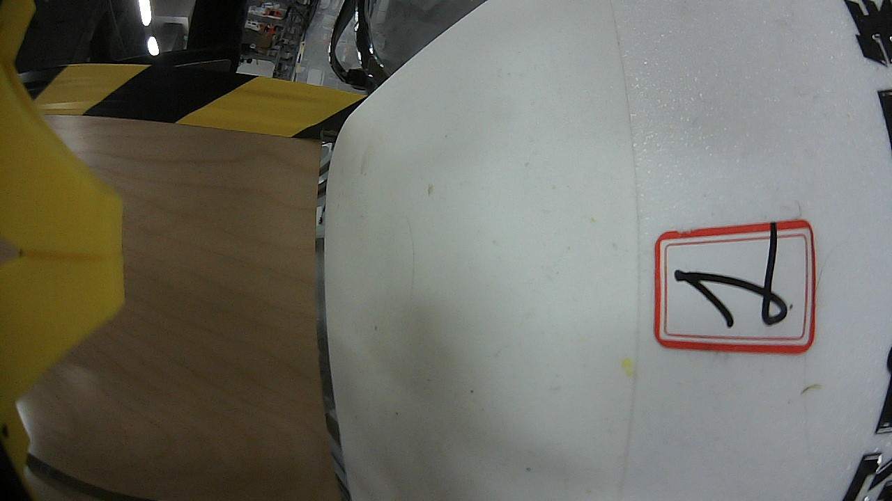
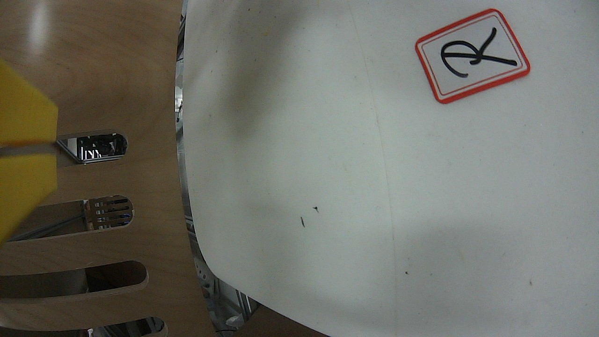

# 机器人三路相机分析：插件工具链与优化历程

> 版本 0.5.0（含常驻桥接 `vlm_bridge_node`）· 2026-08-19 · DSH 重启后插件工具本体直接可用（`rosSetup` 生效）

---

## 1. 环境

| 项 | 值 |
| --- | --- |
| 机器人 | deepcybo-lite（head / wrist_left / wrist_right 三路 USB 相机） |
| 相机话题 | `/deepcybo/lite/camera/{head,wrist_left,wrist_right}/image_raw/compressed`（CompressedImage，1280×720） |
| 视觉 | 并行 VLM 节点 `vlm_node`（`/vlm/describe`）+ 常驻桥接 `vlm_bridge_node`（head）· gemini-2.5-flash（本地网关） |
| 工具 | `ros2_image_snapshot {compressed:true}` / `ros2_vlm_analyze {useBridge|imagePath}`（插件本体） |

**最新调用链**：head 走 **bridge**（`ros2_vlm_analyze {useBridge:true}` → `/vlm_bridge/analyze_latest`，帧缓存内存直传，无取帧/无磁盘）；wrist 两路走 `ros2_image_snapshot` + `ros2_vlm_analyze {imagePath}`。三路并行。

---

## 2. 最新分析结果（v0.5.0）

| 相机 | 画面（docs/images/） | 方式 | VLM 解读（gemini-2.5-flash） | service 耗时 |
| --- | --- | --- | --- | --- |
| head | `r25_head.jpg` | **bridge** | 室内办公/实验环境：几何地毯、黑色圆桌 + 三个透明收纳盒（小船模型/线缆/白色零件，扇形摆放）、沙发、黑色三脚架；无文字、无明显异常 | **3513ms** |
| wrist_left | `r25_wrist_left.jpg` | 文件 | 机器人近距作业面：右侧白壳（红框手写「1」标识）+ 左侧黄色警示板/木纹板；⚠️ 白壳表面**多处污渍/疑似磨损与附着物**（未见严重结构损伤） | **6200ms** |
| wrist_right | `r25_wrist_right.jpg` | 文件 | 近距视角：左侧木纹/黄色机械夹具，右侧白面板（右上红框「R」贴纸）；白面两处细小黑污渍（轻微） | **5128ms** |

**结论**：三路感知与历次一致（head 环境 / left 白壳「1」+ 污损 / right 白板「R」），
wrist_left 的**表面污损/附着物**为持续观察项，建议真机检查。

---

## 3. 优化历程与性能参数对比

### 3.1 链路演进

| 阶段 | 取帧 | 分析 | 每帧链路开销 |
| --- | --- | --- | --- |
| ① bash 串行（手动 source） | `image_snapshot` CLI ×3 串行 | `vlm_call` ×3 串行 | 2 次进程冷启动 + 磁盘中转 |
| ② 插件并行 + `rosSetup` | 插件工具 ×3 并行 | `vlm_analyze` ×3 并行（MultiThreadedExecutor） | 2 次冷启动 + 磁盘中转 |
| ③ **bridge 常驻**（v0.5.0） | 桥接常驻缓存最新帧 | `vlm_bridge_call`（1 次冷启动）→ 内存字节直传 | **~0.7s**（去取帧进程、去磁盘、compressed 免重编码） |

### 3.2 实测性能参数（三路 / head 相机）

| 指标 | ① bash 串行 | ② 插件并行 | ③ bridge |
| --- | --- | --- | --- |
| 三路分析全链路 | ~17s | **~6.6s（≈2.6×）** | — |
| 单路 service（VLM HTTP） | 4.5~5.1s | 3.5~5.6s（avg 4.3s） | **3.0~3.9s** |
| 链路开销（非 VLM 部分） | ~2s | ~2s | **~0.7s** |
| trigger→result（异步） | — | — | 5.4s（VLM 4.2s） |

**关键结论**
1. **VLM HTTP（3~6s）是主导成本**，由网关/模型决定，非插件瓶颈；
2. 插件并行把三路分析从串行 17s 压到 6.6s（≈2.6×）；
3. **bridge 把每帧新增开销从 ~2s 压到 ~0.7s**（常驻 + 内存直传 + 免重编码），
   高频/持续观察场景收益最大；重复调用稳定。

---

## 4. 结论

插件工具链已在真机三路相机（压缩话题、1280×720）上**开箱即用**完成「发现 → 取帧/桥接 → VLM 分析」闭环：
并行调用与常驻桥接分别消除串行等待与进程冷启动，链路开销降至 ~0.7s/帧；感知结果稳定一致。
下一步：`useBridge` 设为默认、bridge 多路支持、或对 wrist_left 污损做持续监控。
