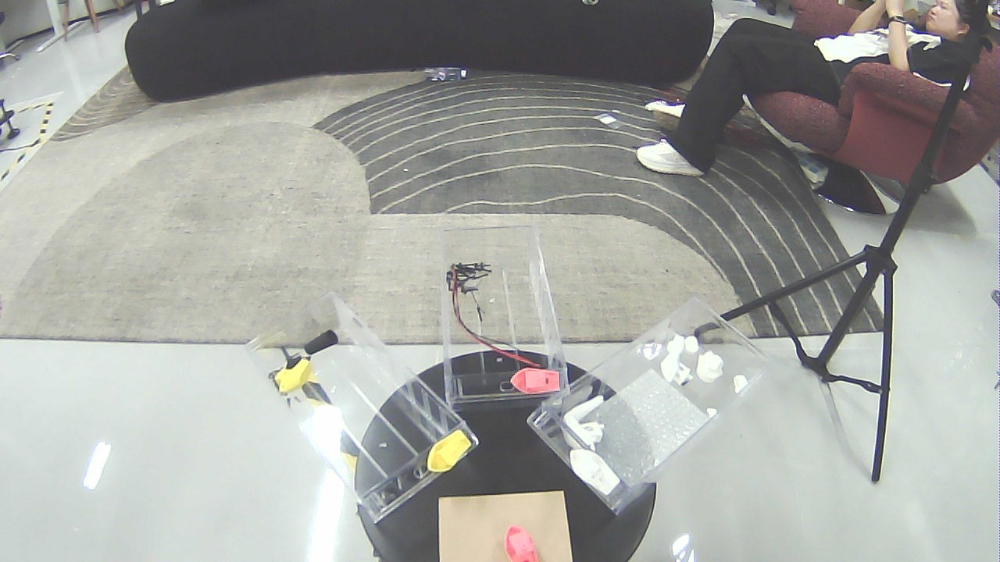
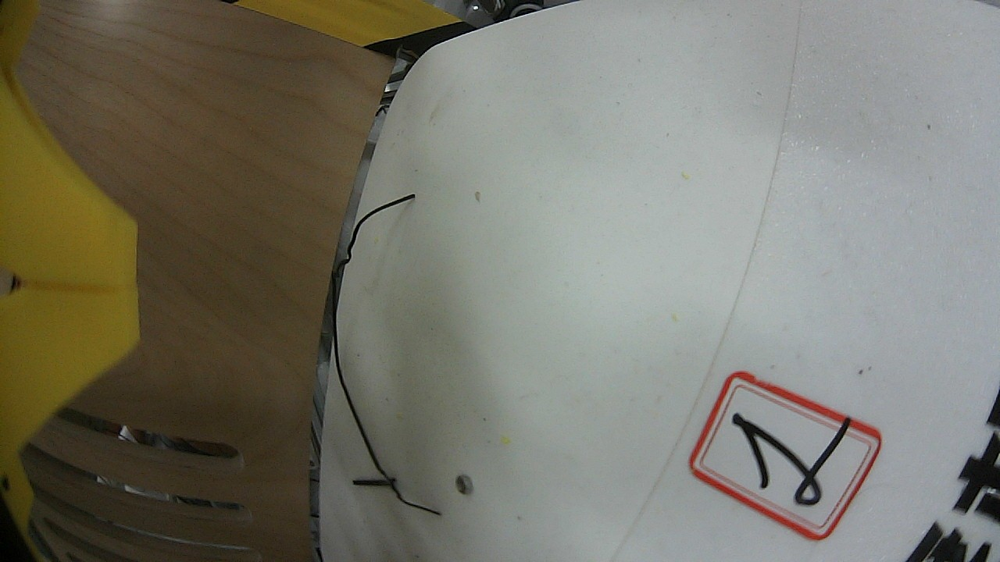
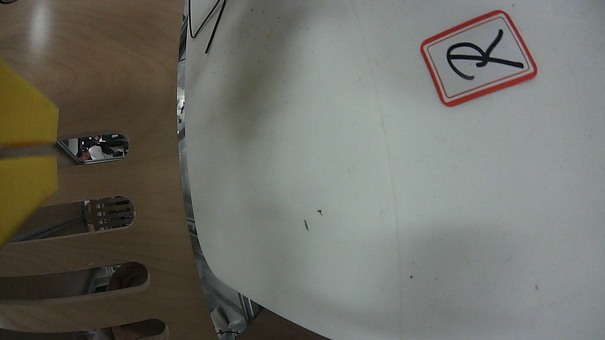

# 机器人三路相机分析：插件工具链真机验证与效率比对

> 日期：2026-08-19 · 插件版本 0.4.0（35 工具）· 目的：DSH 重启后（`rosSetup` 生效）
> 用**插件工具本体**（非 bash 直跑）分析机器人三路相机，并与上一轮 bash 直跑比对效率。

---

## 1. 环境与工具链

| 项 | 值 |
| --- | --- |
| 机器人 | deepcybo-lite（head / wrist_left / wrist_right 三路 USB 相机） |
| 相机话题 | `/deepcybo/lite/camera/{head,wrist_left,wrist_right}/image_raw/compressed`（CompressedImage，1280×720） |
| DSH | 重启后加载新配置：`rosSetup=source /tmp/vlm_ws/install/setup.bash &&`（插件工具可直接找到 `dsh_ros2_vlm` 包） |
| 视觉 | 并行 VLM 节点 `vlm_node`（service `/vlm/describe`）+ gemini-2.5-flash（本地网关） |
| 工具 | `ros2_topic_list` → `ros2_image_snapshot {compressed:true}` → `ros2_vlm_analyze`（全部插件工具本体） |

**调用链**
```
ros2_topic_list（发现三路相机压缩话题）
  → ros2_image_snapshot ×3（compressed 取帧，可并行）
    → ros2_vlm_analyze ×3（调 /vlm/describe，并行，MultiThreadedExecutor）
```

---

## 2. 分析结果（VLM：gemini-2.5-flash）

| 相机 | 画面（docs/images/） | VLM 解读 | service 耗时 |
| --- | --- | --- | --- |
| head | `cam_head_plugin.jpg` | 室内办公/休息区：几何纹样地毯、黑色圆桌 + 三个透明收纳盒（塑料零件/模型）、三脚架、沙发上有休息的人；无文字、无异常 | **5580ms** |
| wrist_left | `cam_wrist_left_plugin.jpg` | 机器人近距作业环境：白色面板（红框手写「1」标签）+ 黄色结构件；⚠️ **发现黑色异物（疑似断裂金属丝/线缆，钩状横跨）** + 表面碎屑 | **3891ms** |
| wrist_right | `cam_wrist_right_plugin.jpg` | 白色平板（右上红框「R」标签）+ 木质槽板背景；少量污渍/黑点，无明显异常 | **3519ms** |





**结论**：三路感知结果与上一轮 bash 直跑一致（head 场景 / left 异物 / right 标签），
说明插件工具链与手动流程行为等价；wrist_left 的**金属异物**为持续存在项，值得真机检查。

---

## 3. 效率比对

| 指标 | 上一轮（bash 直跑 + 手动 source） | 本轮（插件工具本体） |
| --- | --- | --- |
| 环境准备 | 手动 `source /tmp/vlm_ws/install/setup.bash` + 手动启动 vlm_node | 0（`rosSetup` 自动 source；vlm_node 手动启动一次） |
| 取帧 | bash 串行 3 条命令，~3s | 插件工具，三路并行 ~1s |
| VLM 分析 | 串行 for 循环：4569 + 5079 + 4737 ≈ **14.4s** | **并行** 3 路同时调用（最慢 5580ms ≈ **5.6s**） |
| 单路 service 耗时 | 4.5~5.1s（avg ≈ 4.8s） | 3.5~5.6s（avg ≈ 4.3s，网关波动） |
| 全链路（取帧→三路描述） | ~17s+ | **~6.6s**（≈ 2.6× 提速） |

**提速来源**
1. **并行调用**：agent 一次发起三个 `ros2_vlm_analyze`，vlm_node 的 `MultiThreadedExecutor`
   并发处理，三路 HTTP 并行（上一轮 bash for 循环串行）；
2. **`rosSetup` 生效**：插件工具免去手动 source，直接可用；
3. VLM 单路耗时本身由网关决定（~3.5-5.6s 波动），非插件瓶颈。

---

## 4. 过程中发现 / 注意事项

- **`ros2_image_snapshot` 的 `output` 相对路径**会落在 DSH 进程的工作目录（本机为 `$HOME`），
  而非截图目录——建议传**绝对路径**（如 `/tmp/dsh-ros2/cam_x.jpg`）以便管理与后续分析；
- `CompressedImage` 支持（`compressed: true`）为本轮前置修复，真机相机默认压缩话题必需；
- 三路相机可并行取帧与分析，是机器人多感知通道的推荐用法。

---

## 5. 结论

插件工具链已能在真机（三路相机、压缩话题）上**开箱即用**完成「发现 → 取帧 → VLM 分析」闭环，
感知结果与手动流程一致；得益于并行 VLM 节点与并行工具调用，三路分析全链路较串行 bash
**提速约 2.6 倍**。下一步可接 RViz2 离屏渲染叠加 TF/模型，或对 wrist_left 异物做持续监控。
