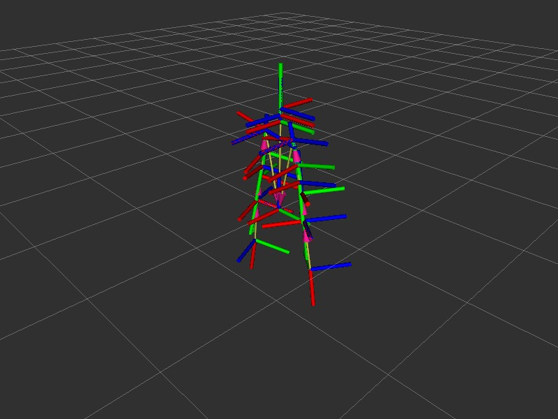
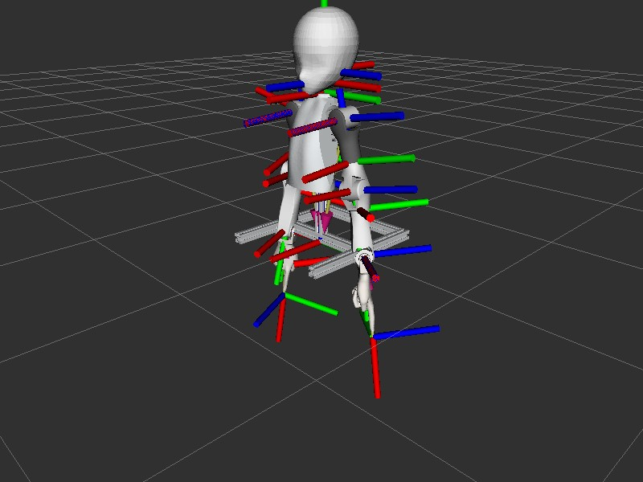

# 机器人状态视觉分析：skill 流水线测试与实时性

> 版本 0.7.0 · 2026-08-20 · 使用 `robot-state-vision-analysis` skill 的完整流水线
> （状态读取 → 离屏渲染 → 传 VLM → 交叉验证）分析真机当前状态，并给出实时性评估。

---

## 1. 方法与流水线

按 skill 指导执行（无头，图像全部来自话题/渲染内核，不依赖 X11 截图）：

```
① 拓扑与状态（L1）   ros2_node_list / joint_states / tf
② 离屏渲染（L4）     rviz_offscreen_node（Xvfb + Grid/TF/RobotModel，Fixed Frame=chest）→ /rviz/scene
③ 传 VLM（L4）       vlm_node + vision_bringup → ros2_vision_analyze /rviz/scene
④ 交叉验证           视觉结论 ↔ 关节数值 ↔ 机器人零位标定语义
```

**零位语义标定（用户提供）**：关节全 0 = **侧平举、肘窝向前**；当前关节非零 = **双臂自由下垂**。

---

## 2. 当前状态分析结果（双臂自由下垂）

### 2.1 关节数值（`/lite/joint_states`，权威）

| 关节 | 左臂 | 右臂 | 解读 |
| --- | --- | --- | --- |
| shoulder_roll | **-1.353 rad** | **+1.384 rad** | 外展 ~±77° → 双臂落下（非侧平举） |
| wrist_yaw | +0.809 rad | +1.576 rad | 腕部回正角度 |
| shoulder_pitch / yaw / elbow_pitch | 0.05 / 0.10 / -0.14 | 0.06 / 0.40 / -0.24 | 其余关节近零 |
| gripper | +0.02 | +0.02 | 闭合/零位 |

**构型结论：双臂自由下垂**（符合用户标定：非零位 ⇒ 下垂）。

### 2.2 离屏渲染视觉（VLM，gemini-2.5-flash）



- **双臂姿态：下垂** ✅（与关节数值、用户标定一致）；
- 站姿：直立且左右对称，朝向一致无扭转；
- **TF 树完整健康**：所有关节坐标轴正确挂载、无飞离/堆叠失效；
- 无物理配置异常；足/盆骨区坐标轴密集属多关节显示的常规现象。

### 2.3 交叉验证结论

| 来源 | 姿态判断 | 一致性 |
| --- | --- | --- |
| 关节数值 | 自由下垂（shoulder_roll ±77°） | 权威基准 |
| VLM 视觉 | 下垂（但附带"接近零位"措辞） | 姿态✅；**零位语义混淆** |
| 零位标定 | 零位=侧平举；当前≠零位 | 确认当前为下垂 |

**发现**：VLM 对姿态的**粗粒度判断正确**（下垂），但其"零位/中性"语义与机器人实际零位定义
（侧平举）不符——源于缺少机器人零位标定信息，**非 skill 硬性问题**；后续可为 skill 补充
各机器人零位语义（如"零位=侧平举、肘窝向前"）以提升视觉解读精度。

---

## 3. 实时性分析

### 3.1 单轮流水线耗时（稳态）

| 阶段 | 耗时 | 说明 |
| --- | --- | --- |
| 状态读取（joint_states） | **~1.2s** | `topic echo --once`（含 DDS 发现） |
| 离屏渲染帧就绪 | 一次性 ~20s | xvfb + OGRE 冷启动（机器人链路常驻后为零） |
| vision_bringup 建桥 | 一次性 ~14s | bridge 启动 + service 注册（常驻后为零） |
| **VLM 分析**（`ros2_vision_analyze`） | **~5.9s** | service 端 HTTP（网关推理主导） |
| **单轮合计**（冷启动后） | **~7.1s** | 状态读取 + VLM（渲染/桥常驻） |

### 3.2 性能构成

- **VLM HTTP（~6s）为绝对主导**，由网关/模型决定，非插件瓶颈；
- 链路开销（bridge 内存直传、无磁盘/重编码、无取帧子进程）**~1s/轮**；
- 并行化收益：多话题分析可并行（vlm_node MultiThreadedExecutor + bridge 多路）；
- 常驻组件（vlm_node / vision_bringup / rviz_offscreen）消除冷启动后，**持续观察场景单轮 ~7s**。

### 3.3 与历史链路对比

| 阶段 | 截图链路（废弃） | 话题+并行 VLM | bridge 常驻（当前） |
| --- | --- | --- | --- |
| 图像获取 | X11 截图+落盘 | 取帧冷启动+磁盘 | 桥接内存直传 |
| 链路开销/轮 | 依赖显示/窗口 | ~2s | **~1s** |
| 无头 | ❌ | ✅ | ✅ |

---

## 4. 结论

- **机器人状态**：双臂自由下垂、直立对称，TF 树完整健康，无物理/变换异常；
- **流水线可用**：skill 指导的「状态→渲染→VLM→交叉验证」在真机（19 节点）上端到端可用，
  `ros2_vision_analyze` 插件工具本体直接工作；
- **交叉验证有效**：视觉（下垂）与数值一致；VLM 零位语义需机器人标定信息补充（后续可选）；
- **实时性**：稳态单轮 ~7s，VLM 推理主导；常驻组件后持续观察可行。

---

## 5. 补充：mesh 渲染与联合分析（v0.8.0，2026-08-20）

### 5.1 机器人本体 mesh 渲染验证

离屏渲染**成功渲染机器人实体几何**（不再只有 TF 骨架）：



- VLM 确认：白色立体模型（底座/躯干/头部连杆外壳），姿态直立，无关节异常/畸变；
- 三个关键根因（详见 `architecture.md` §4.4）：Jazzy RobotModel 属性格式
  （`Description Source/Topic`）、mesh 路径需 `file://` 前缀（resource_retriever fopen
  限制）、视距需适配 mesh 尺度；
- 局限：双臂 mesh 在当前视角/构型下不明显（待视角或构型调整；mesh 本身已加载，
  日志无加载错误）。

### 5.2 联合分析（RViz2 可视化 + 手眼/头部相机，4 路并行）

| 通道 | VLM 结论 |
| --- | --- |
| **RViz2 场景**（mesh 渲染） | 机器人简化几何结构、直立、无异常 |
| **head 头部相机** | 室内工作区，几人在组装机械设备，零件工具散落，无异常 |
| **wrist_left 手眼** | 机器人自身结构（白部件「1」标签 + 黄色防护装置），无异常 |
| **wrist_right 手眼** | 白面板「R」标识 + 木制结构，无异常 |

**联合结论**：3D 渲染（本体几何/姿态）+ 头部相机（环境/人员）+ 手眼相机（近距结构/标签）
四通道互补，状态正常无异常。每路分析 3~6s（VLM 主导）。

### 5.3 发现（记录）

- `vision_bringup` 一次性发现可能不完整（本场合计发现 2/4 路，head 与 rviz_scene
  需手动补桥）——后续可加轮询/刷新发现；
- mesh 渲染的 URDF 发布者需常驻（transient-local 发布者退出后新订阅者收不到）。

---

## 6. 补充：mesh/TF 绑定修复与正确渲染验证（v0.8.1，2026-08-20）

### 6.1 问题：所有零件堆叠在原点

v0.8.0 的 mesh 渲染图（§5.1）视觉上**全部零件 + TF 坐标轴堆叠在原点**，与
"mesh 应与 TF 绑定"的预期不符。排查结论：

1. **根因 = URDF 与 TF 帧名不匹配**：发布给 RobotModel 的 URDF 是一套 `_link` 后缀
   的旧文件（`left_shoulder_pitch_link`…），而真机 TF 帧名为**不带后缀**的
   `left_shoulder_pitch`…。RobotModel 按 URDF link 名查变换全部失败 → 所有 mesh
   渲染到固定坐标系原点。
2. **修复**：直接抓取真机实际描述（订阅 `/robot_description`，21 个 link 名与 TF
   帧名一一对应），mesh 路径改写为 `file:///tmp/live_meshes/…` 后常驻发布到
   `/robot_description_abs`。
3. **次要因素**：`.rviz` 相机 `Distance` 被误设为 8（一次 sed 未匹配），机器人缩成
   画面中心小点；调回 1.8 后得到 RViz 式近景全身视角。

### 6.2 修复后验证


- 节点日志（启动 ~3s 后）：`FM: ... frames=21`，且
  `transformHasProblems(chest/left_shoulder_pitch/left_elbow_pitch/right_wrist_yaw/head/base_link)=0`
  —— rviz 自身 TF 缓冲已解析全部机器人帧（新增的内置诊断）；
- 像素分析：白色 mesh 区域 240×435 px、TF 三色轴纵跨 y 48..520，非原点堆叠；
- VLM 确认：头/躯干/双臂完整、各部件位于正确分离位置（"not collapsed into a
  single point"）、双臂下垂（与关节数值、用户零位标定一致）；
- 连续多帧快照字节一致，渲染稳定。

### 6.3 代码变更（`rviz_offscreen_node.cpp`）

- **删除**了错误的自建 `rclcpp::spin(raw_node)` 线程：`VisualizationManager` 内部
  持有一个 `SingleThreadedExecutor`（构造时 `add_node`），`onUpdate()` 里已
  `spin_some`，自行 spin 会因"node already added to an executor"崩溃（exit 250）；
- **新增** FrameManager 诊断：`getTransformer()->getClassId()`（确认 TF 插件而非
  Identity 回退）、`getAllFrameNames()`、`transformHasProblems()`，预热后打印一次
  全帧名，之后每 20s 打印一行帧数，便于判定 mesh/TF 绑定状态。
