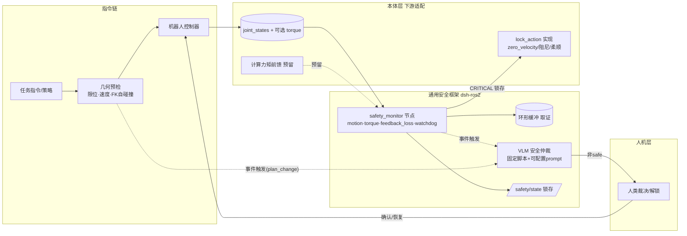

# dsh-ros2 安全框架 · 本体适配交接文档

> 版本 0.14.0+（已实现于 0.14.0/0.14.1；monorepo 拆分后位于 `dsh-ros2-safety` 包）· 配套 `README.md`（使用）· `architecture.md`（总体架构）
> 本文档用于与**后续具体机器人本体适配 agent** 交接，划分清晰的职能边界。

---

## 1. 职能边界（本交接文档的核心）

| 归属 | 范围 |
| --- | --- |
| **dsh-ros2（本仓库，通用框架）** | 安全框架的整体设计、接口与契约定义、`safety_monitor` 节点骨架、状态机（锁存/恢复）、profile `safety` 段 schema 与校验、VLM 仲裁管线（固定格式化脚本 + 默认 prompt）、几何预检钩子、取证环形缓冲、故障注入测试骨架、工具层集成（锁状态查询/拒绝下发）。**对所有机器人通用，不绑定任何本体。** |
| **下游本体适配 agent（具体机器人）** | 本体相关的**数据源**（joint_states/torque 话题名与消息类型）、**数值标定**（阈值/限位/频率/看门狗名单）、**锁动作实现**（zero_velocity 之外：阻尼/柔顺接口）、**力矩前馈动力学参数**（若已有辨识结果）、**轻量触发模型**（如 YOLO，接口已留）、**非 ROS 急停硬件通路**（后续定义）。 |
| **预留接口（暂不实现）** | 计算力矩前馈、YOLO 轻量触发、非 ROS 急停。接口与注释先行，本体适配时按需实现。 |

**铁律**：通用框架不得为迁就某一本体而改变契约；下游不得修改框架的锁存/失效语义，只允许通过 profile 配置与接口实现进行适配。

---

## 2. 设计原则（已确认）

1. **分层防御**：几何预检（执行前，µs-ms）→ 反应式监视（执行中，检测 1-10ms、响应 ≤100ms）→ VLM 语义仲裁（方案变更后，秒级）→ 人类裁决（兜底）。
2. **事件驱动慢层**：VLM 绝不进控制回路，不必要时不拉起；仅在任务方案整体大改（A-B-C → A-D-E-C）或 2/3 异常触发时启动。
3. **失效闭环（fail-closed）**：安全系统自身崩溃/心跳丢失 → 默认锁死；绝不默认放行。
4. **锁存（latch）**：锁一旦触发，条件消失也不自动恢复；必须人工确认 + 显式恢复流程（解锁 → 重新回 home）。
5. **非致命不锁**：严重级别分级，WARNING 级只记录/通知，不触发锁，避免反复锁死。
6. **统一走 ROS2**：除非 ROS 急停（仅接口）外，监视、状态、解锁、参数全部走 ROS2 话题/服务/参数，保证 `ros2 node/topic/param` 可自检可调试。
7. **可注册可配置**：所有阈值、话题、名单、锁动作经 profile `safety` 段注册；参数修改走 L2 审批。
8. **兼容有无力矩反馈**：力觉检查器是可选插件，无 torque 话题时自动禁用并在档案中明示。

---

## 3. 总体架构



### 3.1 状态机（锁存语义）

```
NORMAL ──CRITICAL 事件──▶ LOCKED（锁存）
   ▲                        │
   └── 人工确认 + 恢复流程 ◀──┘
       （解锁 → 重新回 home → 重新注册监视）
```

- `NORMAL`：正常执行；所有运动指令执行前查询 `/safety/state`。
- `LOCKED`：拒绝一切新运动指令（工具层返回锁原因）；锁存不自动清除。
- **恢复仅一条路径**：人类通过解锁服务（L2 审批）确认 → 机器人回 home → 恢复监视。
- WARNING 级事件不进入 LOCKED，仅记录 + 通知（含可选 VLM 诊断）。

---

## 4. 接口契约（dsh-ros2 交付物）

### 4.1 profile `safety` 段（schema，`~/.dsh-ros2/robots/<name>.yaml`）

```yaml
safety:
  enabled: true
  control_frequency: 200          # Hz；监视器非阻塞、并行运行，响应预算 ≤100ms
  checkers: [motion, feedback_loss, watchdog]   # 可插拔；torque 探测到话题时自动追加
  lock_action: zero_velocity      # 最小实现：停发新指令并保持；可注册 damping / 本体柔顺接口
  feedback:
    joint_state_topic: /joint_states
    torque_topic: ""              # 空 = 无力矩反馈 → torque_checker 自动禁用并明示
    timeout_ms: 100               # 静默判失联（CRITICAL）
  watchdog:
    critical_nodes: []            # 掉线即锁（例：controller_manager；safety_monitor 自身由心跳覆盖）
    observed_nodes: []            # 掉线仅 WARNING，不锁（避免非主要进程意外退出导致全锁）
    heartbeat_ms: 500
  motion:
    tracking_error_rad: 0.05      # 位置偏差阈值（跟踪误差监视）
    stall: {window_ms: 200, min_cmd_vel: 0.02, max_actual_vel: 0.005}   # 有指令无运动
    hysteresis: {min_frames: 3, window: 5}   # M-of-K 迟滞，单帧噪声不锁
    max_velocity: {}              # 每关节 rad/s，缺省取 URDF limit（预检用）
    max_acceleration: {}          # 每关节 rad/s²（预检用）
  torque:                         # 无 torque_topic 时整段忽略
    enabled: true
    abs_limit: {}                 # 每关节 Nm 绝对值上限
    dtau_limit: {}                # 突变阈值 Nm/s
    overload_ms: 500              # 持续超限判 CRITICAL
    feedforward_topic: ""         # 计算力矩前馈输入（预留，见 §4.5）
  semantic:
    enabled: true
    arbitrate_script: safety_vlm_arbitrate     # 固定格式化脚本（见 §4.6）
    prompt: |                     # 可个性化配置的裁决依据；缺省见 §5
      你是机器人安全裁决员。……
    trigger_on: [plan_change, tracking_error, stall, feedback_loss,
                 watchdog_critical, torque_spike, torque_overload]
  forensics:
    ring_buffer_s: 5              # 触发前环形缓冲（关节/力矩/渲染帧）
    dump_dir: ~/.dsh-ros2/safety-events
  estop:                          # 仅接口，不实现（后续硬件就绪时定义）
    enabled: false
    path: ""
```

### 4.2 ROS2 接口（safety_monitor 节点）

| 方向 | 名称 | 类型 | 说明 |
| --- | --- | --- | --- |
| 订阅 | `feedback.joint_state_topic` | sensor_msgs/JointState | 关节反馈（必需） |
| 订阅 | `feedback.torque_topic` | 本体定义 | 力矩反馈（可选，无则 torque 禁用） |
| 订阅 | `feedback.feedforward_topic` | 本体定义 | 力矩前馈（预留） |
| 发布 | `/safety/state` | 自定义 `SafetyState` | 锁存状态 + 触发原因 + 严重级（锁定时所有运动工具拒绝下发） |
| 发布 | `/safety/event` | 自定义 `SafetyEvent` | 事件流（含触发原因分类字符串，供取证/仲裁） |
| 发布 | `/safety/heartbeat` | std_msgs/Bool | 监视器自身心跳（供外部 watchdog 监控；心跳丢 = fail-closed 锁） |
| 服务 | `/safety/get_state` | 查询 | L1 只读 |
| 服务 | `/safety/unlock` | 解锁 | **仅经 L2 审批工具调用**，人类确认后才生效 |

> 接口消息类型（msg/srv）由 dsh-ros2 定义并随包发布；本体自定义字段一律经 profile 映射，不改变契约。

### 4.3 checker 插件接口（下游可按需实现）

```python
class SafetyChecker:
    name: str                          # 例: torque
    severity_map: dict                 # 事件→CRITICAL/WARNING
    def setup(self, params: dict)      # profile 段注入
    def on_joint_state(self, msg)      # 非阻塞回调
    def decide(self) -> Event|None     # 返回触发事件（含 cause 分类字符串）或 None
    # 约定：回调不得阻塞；decide 与主循环并行，端到端响应 ≤100ms
```

### 4.4 lock_action 接口（下游实现）

```python
class LockAction:
    name: str                          # zero_velocity | damping | <本体柔顺接口>
    def activate(self)                 # CRITICAL 触发时调用（锁存）
    def deactivate(self)               # 人工解锁后调用
```

- **最小实现（dsh-ros2 交付）**：`zero_velocity` —— 停发新运动指令 + 通知控制器保持。
- **理想实现（下游）**：本体支持的阻尼/柔顺控制（如 lite 小组已验证的零力拖拽链路），直接切该接口。

### 4.5 计算力矩前馈预留接口（暂不实现）

- 已确认 lite 上存在动力学参数辨识 + 计算力矩法前馈（零力拖拽效果良好）。
- 预留 `torque.feedforward_topic` 输入 + `SafetyChecker` 中的前馈叠加钩子；本仓库只留接口与注释，**不实现**。下游在有力矩反馈的机器人上接入辨识参数。
- 顺带注释（留给后续维护）：**碰撞后关节可能丢信号**，导致力矩突变检测不触发 —— 需结合 feedback_loss 与 watchdog 兜底；此坑位在 `torque_checker` 实现中留文字说明。

### 4.6 VLM 安全仲裁（固定脚本 + 可配置 prompt）

- **固定格式化脚本** `scripts/safety_vlm_arbitrate.py`：输入 `(task_context JSON, trigger_cause 字符串, 新鲜渲染帧路径, joint_state 快照)` → 确定性拼装 prompt（**不允许 LLM 参与拼装**，保证高效与可复现）→ 调用既有 VLM 网关 → 输出 `{verdict: safe|unsafe|uncertain, reason, evidence}`。
- **裁决方向**：非 `safe` 一律触发人类裁决（uncertain 按 unsafe 处理）。
- **画面新鲜度**：触发时先抓一帧新的离屏渲染（30Hz/22Hz 成本可控）再送仲裁。
- **prompt 可配置**：经 `semantic.prompt` 个性化；缺省值见 §5。

### 4.7 触发原因分类（预设字符串，输入仲裁 prompt）

| 预设字符串 | 含义 | 严重级 | 是否锁 |
| --- | --- | --- | --- |
| `feedback_loss` | 关节反馈静默 | CRITICAL | 锁 |
| `watchdog_critical` | 关键节点/进程掉线 | CRITICAL | 锁 |
| `tracking_error` | 轨迹跟踪偏差超限（迟滞后） | CRITICAL | 锁 |
| `stall` | 堵转：有指令无运动 | CRITICAL | 锁 |
| `torque_spike` | 力矩突变 | CRITICAL | 锁 |
| `torque_overload` | 力矩持续超限 | CRITICAL | 锁 |
| `plan_change` | 任务方案整体变更 | 仲裁 | 不直接锁，拉起 VLM |
| `watchdog_observed` | 非关键节点掉线 | WARNING | 不锁，记录+通知 |
| `semantic_unsafe` | VLM 判定非 safe | 仲裁 | 锁存/暂停 + 人类裁决 |
| 单帧噪声 | 迟滞未达标 | — | 不锁 |

---

## 5. 缺省 VLM 安全裁决 prompt（最小可用，可配置）

> 由固定脚本注入 `{task_context}` / `{trigger_cause}` / `{joint_state}` 三个槽位。

```
你是机器人安全裁决员。请基于以下信息判断机器人当前是否处于危险状态，需要立即停机或人工干预：

- 任务上下文：{task_context}
- 触发原因：{trigger_cause}
- 机器人当前位形（关节角/末端位姿）：{joint_state}
- 最新离屏渲染画面：<附带图像>

重点核查：
1. 是否即将发生或正在发生碰撞（与障碍物、人员或机器人自身）；
2. 机械臂是否处于失稳、奇异或过伸等危险姿态；
3. 画面中是否出现任务规划未预期的变化（新障碍、人员进入、物体被移动等）。

只输出 JSON，不要任何其他文字：
{"verdict": "safe" | "unsafe" | "uncertain", "reason": "一句话原因", "evidence": "画面中支撑判断的依据"}

规则：verdict 为 uncertain 时一律按 unsafe 处理。
```

---

## 6. 下游适配清单（本体适配 agent 按此交接）

1. **填写 profile `safety` 段**：话题名/消息类型、控制频率、阈值、watchdog 名单（critical 与 observed 分开）、hysteresis。
2. **实现 `lock_action`**：若本体支持零速保持可用缺省 `zero_velocity`；否则实现阻尼/柔顺接口（含 `activate`/`deactivate`）。
3. **力矩反馈**：有力矩 → 填 `torque` 段（或按 checker 接口实现本体 torque_checker）；无力矩 → 保持 `torque_topic: ""`，框架自动禁用并明示。
4. **计算力矩前馈**（若已有辨识参数）：接入 `feedforward_topic` 预留接口。
5. **阈值标定**：在故障注入测试 + 实机试验中校准，避免误锁/漏锁。
6. **后续扩展**（接口已留，不急）：YOLO 等轻量模型触发（替换/前置 `plan_change` 等触发源）、非 ROS 急停硬件通路（`estop` 段，硬件就绪时实现）。
7. **注册流程**：`robot_register` 成功后自动拉起 `safety_monitor`（带 profile 参数）→ `robot_topology` 记录 → `robot_health_check` 聚合 safety 状态 → 所有 arm 工具查询锁。整条链闭合。

---

## 7. 测试计划（故障注入）

| 用例 | 注入 | 期望 |
| --- | --- | --- |
| 跟踪偏差 | 注入 |q_actual − q_cmd| 超限持续 N 帧 | 锁存 + 触发原因 `tracking_error` |
| 堵转 | 有指令、实际速度≈0 | 锁存 + `stall` |
| 反馈丢失 | 停发 joint_states 超 timeout | 锁存 + `feedback_loss` |
| 力矩突变/持续超限 | 注入 torque 尖峰/恒高 | 锁存 + `torque_spike`/`torque_overload` |
| 关键节点掉线 | kill critical node | 锁存 + `watchdog_critical` |
| 监视器自杀 | kill safety_monitor | 心跳丢失 → fail-closed 锁 |
| 非致命 | 停 observed node / 单帧噪声 | **不锁**，记录 + 通知 |
| 锁存语义 | 条件消失后 | 仍 LOCKED，需人工解锁 |
| 恢复流程 | 解锁 → 回 home → 恢复 | 回到 NORMAL |
| 工具层 | LOCKED 时调用 arm 工具 | 拒绝下发，返回锁原因 |
| VLM 仲裁 | golden prompt / verdict 映射 / uncertain | 非 safe → 人类裁决 |

复用现有 mock 机器人测试架构（vitest + ToolDeps fake）+ `ros2 launch` 集成测试。

---

## 8. 交付范围（已实施：0.14.0 → 0.14.1 → 0.15.0 拆分）

**实现（通用框架，本仓库）**
- `safety/` ROS2 包（`dsh_ros2_safety`，构建到 vlm 工作区，与 `vlm/` 同模式）：
  - `msg/SafetyState` / `msg/SafetyEvent` / `srv/GetSafetyState` / `srv/Unlock` / `srv/SetLock`
  - `scripts/safety_core.py`：纯逻辑（无 rclpy）——motion（tracking/stall + 迟滞）、feedback_loss、watchdog（critical/observed 分级）、torque（可选）、锁存状态机、取证环形缓冲；`--selftest` 跑 12 个故障注入场景
  - `scripts/safety_monitor`：rclpy 节点封装（订阅关节/指令/力矩 + 慢速 watchdog 扫描 + `/safety/state`(transient-local) + `/safety/heartbeat` + `/safety/lock_active` + 三个服务）
  - `scripts/safety_vlm_arbitrate`：固定格式化 + 缺省 prompt（§5）+ 既有 `/vlm/describe` 网关
- `dsh-ros2-common/scripts/robot_profile.py` 扩展：register 写入 `safety` 段（URDF 限位自动派生）+ `safety show/set` + 校验
- 工具集成（+5 工具，共 50）：`robot_safety_start`（L2，后台拉起监视器）/ `robot_safety_state`（L1）/ `robot_safety_arbitrate`（VLM 仲裁，非 safe 提示人工）/ `robot_safety_lock` / `robot_safety_unlock`（L2 人工门）；`moveit_move` 执行前查锁（LOCKED 恒拒，`safetyStrict: 'reject'` 时监视器失联 fail-closed）；`robot_register` 成功后自动拉起监视器
- 故障注入测试：vitest 工具层（+13 例，共 109）+ `safety_core --selftest`（12 场景）+ 实机 ROS2 链路验证（发布→NORMAL→停发→LOCKED→解锁→恢复）

> 注：`robot_health_check` 聚合属于 harness/下游侧（本仓库不含该工具），下游 agent 可读 `/safety/state` 接入。

**仅接口/注释，不实现**
- torque_checker 逻辑（随机器人）、damping/柔顺 lock_action、计算力矩前馈、YOLO 触发、非 ROS 急停

**版本**：0.14.0（含 CHANGELOG、README 安全章节、双语文档同步）
