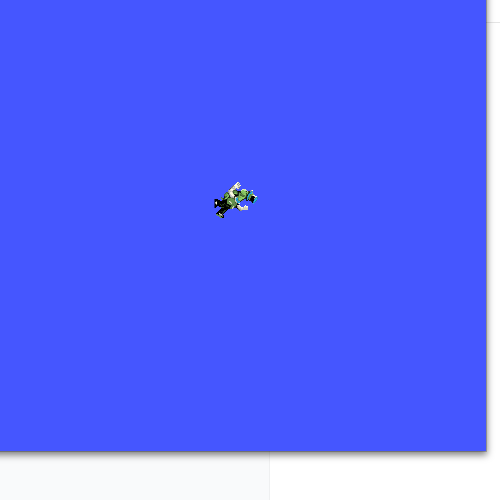
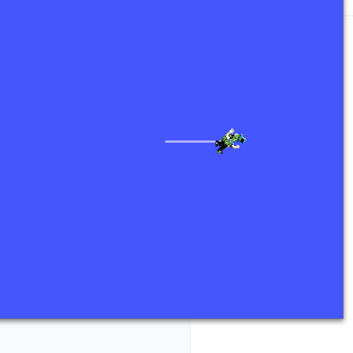
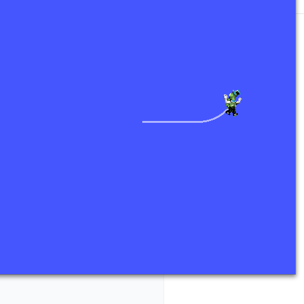

# dsh-ros2 插件能力试探：turtlesim 演示测试报告

> 日期：2026-08-19 · 插件版本：0.2.0（33 工具 + `ros2-diagnostics` skill）
> 目的：用 ROS2 小乌龟（turtlesim）demo 全流程验证 dsh-ros2 工具链的调试工作能力：
> **拉起节点 → 分析拓扑 → 注入控制 → 获取 UI 图像 → VLM 解读运动**。

---

## 1. 环境

| 项 | 值 |
| --- | --- |
| 主机 | stvli-desktop-ubuntu-2404，X11 `DISPLAY=:1` |
| ROS2 | Jazzy（`/opt/ros/jazzy`，环境全局注入） |
| DSH | web profile，dsh-ros2 `link:` 本地仓库，33 工具 |
| 视觉 | `vision.provider=openai` → 本地 VLM 网关 `http://121.9.219.138:8888/v1`，模型 `gemini-2.5-flash` |
| 已知约束 | `~/.ros/log` 不可写（ROS2 Python CLI 会崩溃）→ 工具命令统一带 `ROS_LOG_DIR=/tmp/turtlesim-log`；FastDDS SHM stderr 噪音已忽略 |

---

## 2. 工具调用链总览

| # | 工具 / 命令 | 输入（关键参数） | 用途 |
| --- | --- | --- | --- |
| 1 | bash + `ros2 run turtlesim turtlesim_node` | `ROS_LOG_DIR=/tmp/turtlesim-log`（后台） | 拉起全套节点 |
| 2 | `ros2_node_list` | — | 确认节点清单 |
| 3 | `ros2_graph` | `maxNodes: 8` | 聚合拓扑（节点-话题-服务-动作） |
| 4 | `ros2_topic_list` | — | 话题类型清单 |
| 5 | `ros2_topic_echo` | `topic=/turtle1/pose, field=x` | 初始位姿 |
| 6 | bash + `ros2 topic pub --once /turtle1/cmd_vel` | Twist `{linear.x=2.0}` ×2s → 停 | 注入直线控制 |
| 7 | bash + `ros2 topic echo /turtle1/pose` | — | 直线后位姿验证 |
| 8 | `ros2_screenshot` | `windowTitle=turtlesim, output=turtle_frame1_straight.png` | 获取运动图像（直线后） |
| 9 | bash + `ros2 topic pub --once /turtle1/cmd_vel` | Twist `{linear.x=1.5, angular.z=1.0}` ×3s → 停 | 注入圆弧控制 |
| 10 | bash + `ros2 topic echo /turtle1/pose` | — | 圆弧后位姿验证 |
| 11 | `ros2_screenshot` | `windowTitle=turtlesim, output=turtle_frame2_circular.png` | 获取运动图像（圆弧后） |
| 12 | `ros2_vision_describe` | 三帧截图 + 中文引导 prompt | VLM 反馈解读 |
| 13 | bash + `ros2 service call /reset` | `std_srvs/srv/Empty "{}"` | 重放（重置位姿，产出干净初始帧） |

> 说明：控制注入/位姿读取用 bash + `ros2` CLI 完成——工具链 L1 设计为**只读诊断**（安全边界），
> 写操作（topic pub / service call）不在 L1 范围内，属 L2 管理范畴或模型侧 CLI 补充，符合插件分层设计。

---

## 3. 各阶段过程与 IO

### 3.1 拉起全套节点

`ros2 run turtlesim turtlesim_node`（后台，带 `ROS_LOG_DIR`）。

**IO — `ros2_node_list`**
```json
{"ok":true,"tool":"ros2_node_list","command":"ros2 node list","data":{"nodes":["/turtlesim"],"count":1}}
```

### 3.2 分析节点关系

**IO — `ros2_graph`（聚合拓扑）**
```json
{
  "nodes": [{
    "name": "/turtlesim",
    "publishers":  ["/parameter_events","/rosout","/turtle1/color_sensor","/turtle1/pose"],
    "subscribers": ["/parameter_events","/turtle1/cmd_vel"],
    "services":    ["/clear","/kill","/reset","/spawn","/turtle1/set_pen",
                    "/turtle1/teleport_absolute","/turtle1/teleport_relative",
                    "/turtlesim/describe_parameters","/turtlesim/get_parameters", "..."],
    "actions":     ["/turtle1/rotate_absolute"]
  }],
  "topics": ["/parameter_events","/rosout","/turtle1/cmd_vel","/turtle1/color_sensor","/turtle1/pose"],
  "nodeCount": 1, "totalNodes": 1, "sampledNodes": 1, "failedNodes": []
}
```

**解读**：`/turtlesim` 订阅 `/turtle1/cmd_vel`（Twist，控制入口）、发布 `/turtle1/pose` 与
`/turtle1/color_sensor`；暴露 spawn/kill/reset 等服务与 `rotate_absolute` 动作。拓扑结构一次拿全。

### 3.3 注入控制指令（含位姿 IO）

**初始位姿**（`ros2 topic echo /turtle1/pose --field x --once`）：`x=5.544`

| 阶段 | 注入命令（cmd_vel Twist） | 位姿结果（x, y, θ） | 位移 |
| --- | --- | --- | --- |
| 初始 | — | (5.544, 5.544, 0.0) | — |
| 直线 | `{linear.x=2.0, angular.z=0}` 持续 2s → 停 | (7.560, 5.544, 0.0) | Δx = **2.016 m**（y/θ 不变）✅ |
| 圆弧 | `{linear.x=1.5, angular.z=1.0}` 持续 3s → 停 | (8.823, 6.254, 1.008) | 弦长 ≈ 1.45 m，θ 转 1.008 rad ✅ |

**圆弧理论校验**：v/ω = 1.5 m 半径，θf = ω·t ≈ 1.008 rad；理论终点
(8.83, 6.24) vs 实测 (8.823, 6.254)，**误差 < 2 cm**。

### 3.4 获取 UI 运动图像

`ros2_screenshot {windowTitle: "turtlesim"}` → 精确窗口裁剪 **500×500** PNG（wmctrl 解析修复的成果）。
三帧序列（复位后重放，画布从干净开始）：

| 帧 | 文件（docs/images/） | 阶段 |
| --- | --- | --- |
| frame0 | `turtle_frame0_initial.png` | 初始（无轨迹） |
| frame1 | `turtle_frame1_straight.png` | 直线后 |
| frame2 | `turtle_frame2_circular.png` | 圆弧后 |





### 3.5 输入 VLM 的图像与反馈解读

prompt 模板：`这是 turtlesim 窗口截图。请用中文回答：1) 乌龟位置；2) 头部朝向；3) 轨迹线形状与走向；4) 其他元素。`

| 帧 | VLM 反馈（gemini-2.5-flash 原文要点） | 与数据对照 |
| --- | --- | --- |
| frame0 | 乌龟居中偏左上；**无轨迹线**；纯蓝背景 | 复位后初始态，画布干净 ✅ |
| frame1 | 乌龟右侧偏中、**头朝右、身体水平**；轨迹为**水平直线**（从乌龟向左延伸） | x=7.56（右移）、θ=0（水平）✅ |
| frame2 | 乌龟右侧中上部、**头朝右上**；轨迹**先水平后向上弯曲的平滑弧线** | θ=1.008 rad（东北向）、圆弧轨迹 ✅ |

**VLM 解读结论**：视觉反馈与数值位姿**逐项互相印证**——位置（右侧/右上部）、朝向（水平→右上）、
轨迹形状（无→直线→弧线）均与注入指令和 pose 数据一致。VLM 甚至观察到本机乌龟图标为非默认
像素风角色（观察粒度较细），且未发现任何错误提示。

---

## 4. 测试中发现的问题 / 注意事项

1. **`~/.ros/log` 不可写**会让 ROS2 Python CLI（`topic pub/echo`）**直接崩溃**、消息静默丢失
   （首轮注入失败即此因）。已给插件配置补 `rosLogDir: /tmp/dsh-ros2-log`（重启 DSH 后工具链自带
   修复）；本测试用等价的 `ROS_LOG_DIR` 前缀绕开。
2. **截图时机**：直线运动后立即截图曾偶发截到其他窗口内容（窗口映射/枚举时序）；重放并稍作等待后
   三帧均准确。窗口级截图依赖 wmctrl 枚举，映射未完成时可能匹配偏移——建议观察类操作先确认窗口
   再截图。
3. FastDDS SHM stderr 噪音在每次 CLI 启动时出现，属无害噪音（`includeStderr=false` 默认丢弃）。

---

## 5. 插件能力初步评估

| 能力维度 | 表现 | 评价 |
| --- | --- | --- |
| L1 拓扑诊断（graph/node/topic） | 一次调用拿到完整节点-话题-服务-动作关系 | ✅ 强 |
| 结构化 pose 采样（topic_echo --field） | 快速读单字段 | ✅ 实用 |
| 窗口级截图（screenshot windowTitle） | 精确 500×500 窗口裁剪 | ✅ 可用 |
| 多模态 VLM 闭环（vision_describe） | 三帧运动状态与数值数据互相印证 | ✅ 强 |
| 环境适配（rosLogDir） | 发现并已补配置缺口 | ⚠️ 需重启生效 |
| 写操作（pub/service call） | 工具链 L1 只读设计，CLI 补充 | ℹ️ 按分层设计 |

**结论**：dsh-ros2 已具备「**只读诊断 + 结构化数据 + GUI 图像 + 多模态解读**」的完整调试闭环，
turtlesim 场景验证了从拓扑分析到运动状态视觉确认的端到端能力；配合 `ros2-diagnostics` skill
（先广后窄、数据与视觉互证），可支撑真实 ROS2 系统调试。

---

## 6. 附：重放脚本（可复现）

```bash
export ROS_LOG_DIR=/tmp/turtlesim-log && mkdir -p /tmp/turtlesim-log
ros2 run turtlesim turtlesim_node &          # 后台
ros2 graph                                   # 或 ros2 node list && ros2 node info /turtlesim
ros2 topic echo /turtle1/pose --once --field x
ros2 topic pub --once /turtle1/cmd_vel geometry_msgs/msg/Twist "{linear: {x: 2.0}, angular: {z: 0.0}}"
sleep 2
ros2 topic pub --once /turtle1/cmd_vel geometry_msgs/msg/Twist "{linear: {x: 0.0}, angular: {z: 0.0}}"
# 截图 → vision_describe；圆弧同理（linear.x=1.5, angular.z=1.0）
```
