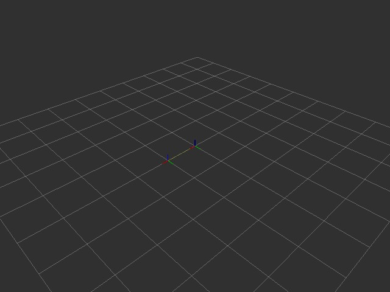

# dsh-ros2 实时视觉：并行 VLM 节点 + 无头图像通道（L4）

> 版本 0.4.0 · 2026-08-19 · 动机：具身 agent 的实时性与无头部署
> 配套：`docs/turtlesim-test-report.md`（旧截图链路基线）· `vlm/`（ROS2 包）

---

## 1. 背景与目标

旧视觉链路（截图 → 落盘 → HTTP VLM）有三个根本问题：

| 问题 | 表现 |
| --- | --- |
| **实时性差** | VLM HTTP 往返 2.3~7.2s，agent 每帧串行阻塞，无缓存 |
| **依赖 X11** | 窗口级截图要求显示服务器 + 窗口管理器，偶发截到最上层窗口 |
| **无头不可用** | 机器人必然是无头计算机，不存在屏幕可截 |

本迭代目标：**VLM 分析进独立进程，用 ROS2 管理多进程通信（与机器人控制系统一致）；图像一律来自
ROS2 图像话题（相机话题 / RViz2 离屏渲染话题），彻底摆脱截图通道。**

---

## 2. 架构

```
┌─ ROS2 图（多进程，与机器人控制系统无缝衔接）─────────────────────────┐
│                                                                      │
│  /camera/image (相机/仿真)   /rviz/scene (RViz2 离屏渲染, 可选)        │
│              │                │                                      │
│              └──────┬─────────┘                                      │
│                     ▼                                                │
│  [vlm_node]  (独立 Python 进程，常驻，MultiThreadedExecutor)          │
│       ├─ service  /vlm/describe   (VlmDescribe.srv: 图像+prompt→描述)│
│       └─ topic    /vlm/description (VlmDescription.msg,              │
│                     transient-local：新订阅者秒取最新结果)            │
│              ▲                                                      │
│  dsh-ros2 工具（agent 侧）：                                         │
│    ros2_image_snapshot  → 订阅图像话题取最新帧 → JPEG（无 X11）        │
│    ros2_vlm_analyze     → 调 /vlm/describe → 描述（JSON）             │
└──────────────────────────────────────────────────────────────────────┘
```

**实时性收益**
1. VLM 常驻进程：HTTP 连接复用、结果缓存，agent 不再每帧冷启动调用；
2. `/vlm/description` transient-local 缓存：新订阅者**瞬间**拿到最新分析（0 等待）；
3. 分析在独立进程并行执行，agent 可订阅话题轮询而不阻塞主流程；
4. 图像字节/路径经 ROS2 传输，不经磁盘截图链路。

**无头收益**：图像唯一来源是 `sensor_msgs/Image` 话题（真机上即相机话题，
或 `dsh_ros2_rviz_offscreen` 发布的 RViz2 场景渲染话题）。

---

## 3. 组件（ROS2 包 `dsh_ros2_vlm`，见 `vlm/`）

| 脚本 | 角色 | 接口 |
| --- | --- | --- |
| `vlm_node` | VLM 并行进程 | service `/vlm/describe` + topic `/vlm/description` |
| `image_snapshot` | 话题取帧（一次性 CLI） | 订阅图像话题 → JPEG 文件 + JSON |
| `vlm_call` | service 客户端（一次性 CLI） | 调 `/vlm/describe` → JSON |

**接口定义**（`vlm/srv/VlmDescribe.srv` / `vlm/msg/VlmDescription.msg`）：

```
# VlmDescribe.srv
string image_path        # 主机图像路径（常用）
string image_bytes_b64   # 内联 base64（可选，优先）
string prompt
string model             # 空 = 节点默认
---
bool success
string description
float32 elapsed_ms
string error

# VlmDescription.msg（/vlm/description）
builtin_interfaces/Time stamp
string source
string prompt
string description
float32 elapsed_ms
```

VLM 后端为 OpenAI 兼容 `/chat/completions`（实测本地网关 gemini-2.5-flash）。
API key 经参数或 `VLM_API_KEY` 环境变量注入，不落盘明文。

**环境适配**：两个节点启动时自动探测 `~/.ros/log` 可写性，不可写则回退
`/tmp/ros-log-<uid>`（rclpy 在只读日志目录下会直接崩溃）。插件侧
`runCommand` 也内置同样的回退（`ensureWritableRosLogDir`），锁定的无头主机开箱即用。

---

## 4. 构建与启动

```bash
# 构建 ROS2 包（任一 colcon workspace）
mkdir -p /tmp/vlm_ws/src && ln -s <repo>/vlm /tmp/vlm_ws/src/dsh_ros2_vlm
cd /tmp/vlm_ws && colcon build --symlink-install && source install/setup.bash

# 启动 VLM 并行进程
VLM_API_KEY=sk-... ros2 run dsh_ros2_vlm vlm_node &

# 无头取帧 + 分析（即插件 ros2_image_snapshot / ros2_vlm_analyze 的后端）
ros2 run dsh_ros2_vlm image_snapshot --ros-args -p topic:=/camera/image -p output:=/tmp/f.jpg
ros2 run dsh_ros2_vlm vlm_call --ros-args -p image_path:=/tmp/f.jpg -p prompt:='Describe this'
```

插件工具（重启 DSH 后生效）：`ros2_image_snapshot {topic, output, timeoutMs}`、
`ros2_vlm_analyze {imagePath, prompt, model}`。

---

## 5. 实时性实测对比

| 阶段 | 旧链路（截图+进程内 HTTP） | 新链路（ROS2 并行 VLM） |
| --- | --- | --- |
| 图像获取 | X11 窗口截图 ~百 ms + 落盘 | 话题取帧（`image_snapshot`）即时 |
| VLM 分析 | 2.3~7.2 s（每帧冷启动） | **1.6~2.0 s**（service 实测） |
| 重复消费 | 每次重新 HTTP | `/vlm/description` 缓存 **0 等待** |
| 无头支持 | ❌ 依赖 X11 | ✅ 纯话题 |
| 并行 | ❌ agent 串行阻塞 | ✅ 独立进程，MultiThreadedExecutor |

---

## 7. 与机器人控制系统的关系

- 通信协议全部是 ROS2 标准形态（service / topic / sensor_msgs），与机器人控制栈一致；
- 真机部署：图像话题（相机 / RViz2 离屏渲染）即数据源，agent 侧工具零改动；
- 后续可将 VLM 分析做成订阅式（topic 节流持续分析）或 action（长任务），
  与 MoveIt/导航等控制 action 体系同构。

---

## 7.5 RViz2 离屏渲染（dsh_ros2_rviz_offscreen，v0.4.0）

> 解决「真实 RViz2 可视化」的无头获取：不重画、不截屏，直接驱动 rviz 渲染内核。

### 为什么

早期方案曾用插件自绘简化图验证通道——这不符合真实需求。
用户要的是 **RViz2 渲染出的真实场景**（TF 树 / Grid / URDF / 点云 / Marker），且**不借助
物理显示器与窗口层级**（无头机器人）。rviz2 官方无无头模式，但它的渲染内核是 OGRE，
可以**离屏渲染**。

### 技术方案（已实测）

```
Xvfb（虚拟 X：仅提供 OGRE 的 GLX context，无物理屏幕、无窗口管理器）
   └─ rviz_offscreen_node（C++，链接 rviz_common + OGRE + rviz_default_plugins）
        ├─ RenderPanel + VisualizationManager（真实 rviz 栈）
        ├─ 加载 .rviz 配置（Grid / TF / RobotModel / PointCloud2 / Marker ...）
        ├─ 主循环：onUpdate（Display 数据流）+ 离屏渲染（captureScreenShot）
        └─ 发布 /rviz/scene (sensor_msgs/Image, raw RGB)
              │
              ▼
        ros2_image_snapshot（取帧）→ ros2_vlm_analyze（并行 VLM）→ 描述
```

关键点：
- **渲染内核输出**：`captureScreenShot()` 读 OGRE RenderTarget，非 X 截图、无窗口层级；
- **GL context**：OGRE 需要 GLX，由 Xvfb + Mesa llvmpipe（软件 GL 4.5）提供；
  机器人上可跑轻量 Xvfb，物理显示器完全不需要；
- **Qt**：默认 xcb platform（offscreen platform 与 OGRE GLX 冲突，已踩坑排除）；
- **Display 加载**：`vm.load()` 需传 .rviz 的 `Visualization Manager` 子段（非整个文件）。

### 实测（本机，图像全程走话题、零显示器依赖）

| 场景 | 渲染结果 | VLM 反馈 |
| --- | --- | --- |
| Grid + TF（map→odom→base_link 静态 TF） | Grid 网格 + 两个 RGB 坐标轴 | 「网格地面：有；坐标轴：有（红绿蓝三轴）；Orbit 俯视视角」✅ |
| 相机话题 `/camera/image`（直取帧） | 320×240 传感器帧 | 「CAM 765 + 渐变背景」✅ |




### 构建与启动

```bash
mkdir -p /tmp/vlm_ws/src && ln -s <repo>/vlm /tmp/vlm_ws/src/dsh_ros2_vlm \
  && ln -s <repo>/offscreen /tmp/vlm_ws/src/dsh_ros2_rviz_offscreen
cd /tmp/vlm_ws && colcon build --symlink-install && source install/setup.bash

# 1) 提供场景数据（示例：静态 TF；真机为 robot_state_publisher / 相机等）
ros2 run tf2_ros static_transform_publisher 0 0 0 0 0 0 map odom &
ros2 run tf2_ros static_transform_publisher 1 0 0 0 0 0 odom base_link &

# 2) 离屏渲染节点（Xvfb 内部提供 GL context；图像发布到 /rviz/scene）
xvfb-run -a -s "-screen 0 1280x800x24" \
  ros2 run dsh_ros2_rviz_offscreen rviz_offscreen_node --ros-args \
    -p config_path:=/path/to/scene.rviz -p topic:=/rviz/scene \
    -p width:=800 -p height:=600 -p rate:=5.0

# 3) 无头取帧 + VLM（复用 L4 工具链）
ros2 run dsh_ros2_vlm image_snapshot --ros-args -p topic:=/rviz/scene -p output:=/tmp/f.jpg
ros2 run dsh_ros2_vlm vlm_call --ros-args -p image_path:=/tmp/f.jpg -p prompt:='Describe'
```

参数：`config_path`（.rviz 文件）、`topic`、`width`/`height`、`rate`。

### 已知限制

- `rviz_default_plugins/Image`（相机贴图面板）在无头下因内嵌渲染面板崩溃——
  相机图请直接用 `ros2_image_snapshot` 从相机话题取帧（更直接，已在实测验证）；
- 每帧经 PNG 编解码（captureScreenShot → libpng），5Hz 足够 VLM 场景；高帧率可改直接 readPixels；
- 依赖 Xvfb + Mesa（软件 GL）：机器人部署需安装 `xvfb`（无物理屏）；性能敏感场景可换 GPU + X。

---

## 8. 已知限制 / 下一步

- `image_snapshot` 目前取"最新一帧"，无帧率控制；高帧率相机可加采样节流；
- VLM 单请求延迟 ~1.6-2s 是网关/模型固有（并行进程缓解了 agent 阻塞，但单帧分析本身仍在此量级）；
- 下一步候选：agent 侧异步消费（订阅 `/vlm/description` 而非同步调用）、
  prompt 模板库、图像话题 QoS 兼容（compressed 图像）、离屏渲染 readPixels 直出（去掉 PNG 中转）。
